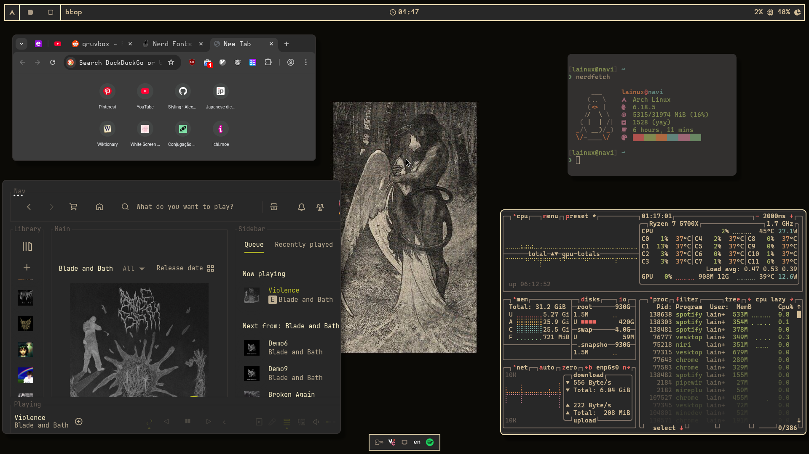

# 🦊 Dotfiles
This repository contains my Arch Linux system dotfiles.

## Resources
- **Wayland Compositors**: [niri](https://yalter.github.io/niri) & [hyprland](https://wiki.hypr.land) 
- **Terminal**: [kitty](https://sw.kovidgoyal.net/kitty)
- **Notification Daemon**: [dunst](https://dunst-project.org)
- **Wallpaper Daemon**: [awww](https://codeberg.org/LGFae/awww) (the package name on Arch Linux is still swww) 
- **Screen Lock**: [hyprlock](https://github.com/hyprwm/hyprlock)
- **Application Launcher**: [fuzzel](https://codeberg.org/dnkl/fuzzel)
- **Bar**: [waybar](https://github.com/Alexays/Waybar)
- **PDF Viewer**: [zathura](https://pwmt.org/projects/zathura) and [okular](https://okular.kde.org)
- **EPUB Viewer:** [calibre](https://calibre-ebook.com)
- **File Manager**: [yazi](https://yazi-rs.github.io)
- **Spotify Client Customizer**: [spicetify](https://spicetify.app)
- **Terminal fetch**: [nerdfetch](https://github.com/ThatOneCalculator/NerdFetch)

## Screenshots

### Note
> All my files (or my dotfiles, if you will) are managed with the aid of [GNU stow](https://www.gnu.org/software/stow) — hence the seemingly weird structure of this repository.

> Screenshots are probably outdated. Don't rely too much on them.

> My config files are heavily influenced by those posted on the subreddit r/unixporn. I don't claim credit for them; but, in equal degree, I didn't blindly copy them, for I've implemented my own modifications.
