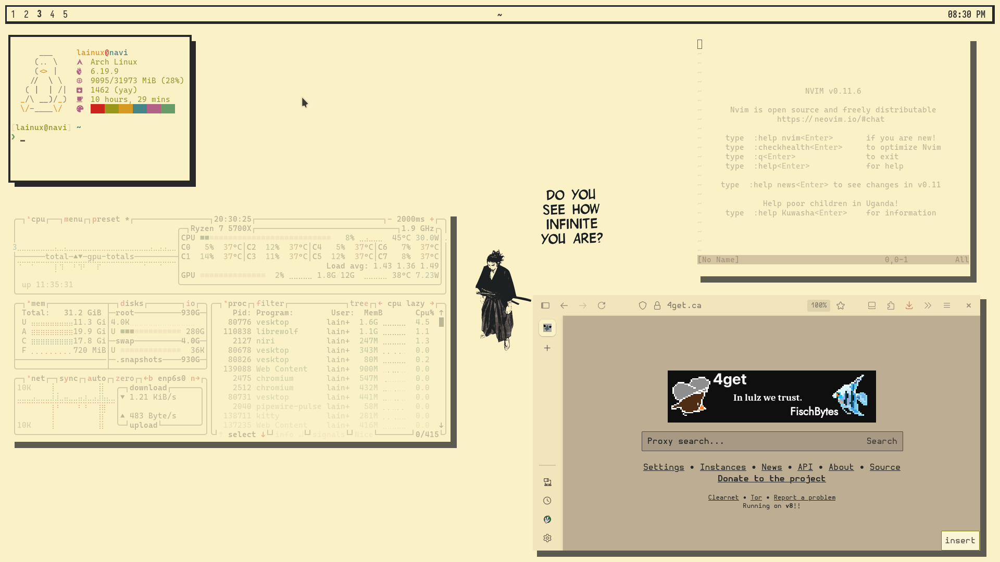

# Dotfiles
This repository contains my main computer dotfiles.

## Resources
- **Wayland Compositors**: [niri](https://yalter.github.io/niri) & [hyprland](https://wiki.hypr.land) (I like to hop between the two)
- **Terminal Emulator**: [kitty](https://sw.kovidgoyal.net/kitty)
- **Notification Daemon**: [dunst](https://dunst-project.org)
- **Wallpaper Daemon**: [awww](https://codeberg.org/LGFae/awww)
- **Screen Lock**: [hyprlock](https://github.com/hyprwm/hyprlock)
- **Application Launcher**: [fuzzel](https://codeberg.org/dnkl/fuzzel)
- **Bar**: [waybar](https://github.com/Alexays/Waybar)
- **PDF Viewer**: [zathura](https://pwmt.org/projects/zathura) and [okular](https://okular.kde.org)
- **EPUB Viewer:** [calibre](https://calibre-ebook.com)
- **Terminal File Manager**: [yazi](https://yazi-rs.github.io)
- **Spotify Client**: [spicetify](https://spicetify.app)
- **Terminal Fetch**: [nerdfetch](https://github.com/ThatOneCalculator/NerdFetch)

## Screenshots

    
<b>Current</b>

        

    
<b>Old</b>

        

### Note
> I use [GNU stow](https://www.gnu.org/software/stow) to manage my dotfiles.

> There's a high chance the screenshots are outdated. 

> I took inspiration from other's .dotfiles.
